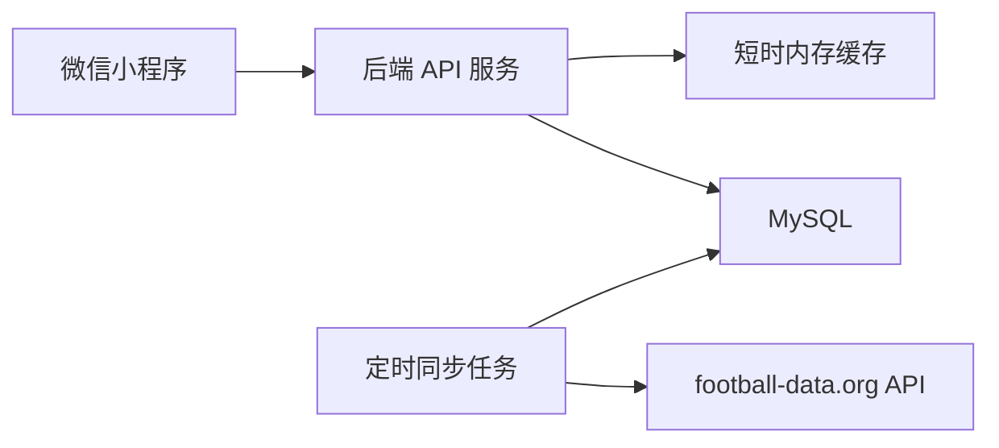

# 2026 世界杯赛事伴侣技术方案

## 1. 技术选型

- 小程序端：微信原生小程序。
- 后端服务：Node.js + TypeScript + Express。
- 数据库：MySQL 8.x。
- 数据同步：后端内置定时任务，调用 football-data.org API 后写入 MySQL。
- 部署环境：云服务器 + 1Panel。
- 时间标准：数据库保存 UTC 时间，接口默认返回北京时间展示字段。

## 2. 总体架构



### 2.1 访问原则

- 小程序只请求自有后端，不直接请求 football-data.org。
- football-data.org Token 只保存在服务端环境变量中。
- 首页、赛程、比赛详情、积分、淘汰赛、射手榜均从 MySQL 读取。

### 2.2 数据同步原则

- 第三方 API 数据以 upsert 方式写入，避免重复数据。
- 同步失败不清空旧数据。
- 每次同步写入 `sync_logs`，便于排查 API 权限、频控和字段变化问题。
- 当前免费等级额度按每分钟 10 次请求设计，默认采用实时优先但不打满额度的同步策略。

## 3. 后端模块

```text
backend/
  src/
    config/          环境变量和业务配置
    db/              MySQL 连接池
    jobs/            定时任务
    middleware/      Express 中间件
    repositories/    数据库访问层
    routes/          API 路由
    services/        业务服务和第三方 API 客户端
    utils/           时间、状态、响应工具
  database/
    schema.sql       MySQL 建表脚本
```

## 4. API 设计

### 4.1 首页

`GET /api/home`

返回：

- 赛事进度。
- 今日比赛。
- 未来 7 天比赛。
- 最近同步时间。

### 4.2 赛程

`GET /api/matches`

参数：

- `date_from`：北京时间日期，格式 `YYYY-MM-DD`。
- `date_to`：北京时间日期，格式 `YYYY-MM-DD`。
- `stage`：阶段。
- `group`：小组。
- `status`：比赛状态。

### 4.3 比赛详情

`GET /api/matches/:apiMatchId`

用途：展示正在进行或已结束比赛的比分进程、技术统计、事件和阵容。接口只读取 MySQL，不在用户点击时直连 football-data.org。

### 4.4 积分榜

`GET /api/standings?group=GROUP_A`

### 4.5 淘汰赛

`GET /api/knockouts`

### 4.6 射手榜

`GET /api/scorers?limit=20`

### 4.7 开赛订阅

`POST /api/subscriptions/matches`

`POST /api/subscriptions/matches/cancel`

`POST /api/subscriptions/matches/status`

用途：订阅未开始比赛的开赛提醒，取消尚未发送的提醒，并查询当前用户已订阅比赛。

### 4.8 手动同步

`POST /api/admin/sync`

`POST /api/admin/sync/match-details`

用途：部署初期或排查问题时手动触发同步。

安全要求：

- 请求头必须携带 `X-Admin-Token`。
- `X-Admin-Token` 需与服务端环境变量 `ADMIN_SYNC_TOKEN` 一致。

## 5. 数据库设计

核心表：

- `competitions`
- `teams`
- `matches`
- `match_details`
- `standings`
- `scorers`
- `sync_logs`

建表脚本见 [schema.sql](backend/database/schema.sql)。

## 6. 同步策略

默认策略：

- matches：每 1 分钟同步一次，用于保障比分、状态和赛程新鲜度。
- match_details：每 1 分钟同步一次，只同步正在进行和近期已结束的比赛详情。
- standings：每 5 分钟同步一次，用于更新小组积分。
- scorers：每 5 分钟同步一次，用于更新射手榜。
- teams：每天同步一次，用于补充球队名称、简称、队徽等低频变化数据。
- 手动同步：通过管理接口触发一次全量同步。

额度估算：

- 常规分钟：matches 1 次请求，另按候选比赛最多同步 6 场 match_details。
- 每 5 分钟整点：matches + standings + scorers + match_details。
- 每天 teams 触发分钟：在上述基础上额外增加 1 次 teams 请求。
- 在免费额度 10 次/分钟下，默认策略留有余量。

## 7. 缓存策略

- 首页接口默认缓存 60 秒。
- 赛程、积分、淘汰赛、射手榜接口默认缓存 60 秒。
- 管理同步成功后清空缓存。

首版使用进程内缓存，后续如并发增大或多实例部署，可迁移到 Redis。

## 8. 时区策略

- football-data.org 返回 UTC 时间。
- MySQL 保存 `utc_date`。
- 同步时生成 `beijing_date` 字段，便于按北京时间查询今日和未来 7 天。
- 接口同时返回 `utcDate` 和 `beijingTimeText`。

## 9. 部署策略

- 通过 1Panel 创建 MySQL 数据库。
- 通过 1Panel 部署 Node.js 应用或容器。
- 在 1Panel 中配置环境变量。
- 使用 Nginx 反向代理后端 API。
- 小程序后台配置 request 合法域名为后端 HTTPS 域名。

## 10. 风险与降级

- 免费等级 API 可能无法访问射手榜或完整世界杯数据：接口返回空数据时，小程序展示降级空状态。
- 第三方 API 频控：同步任务需要记录失败原因，不能循环重试打爆额度。
- 数据延迟：页面展示最近更新时间，避免误导用户。
- 官方素材版权：首版不使用 FIFA 官方 Logo、奖杯图、吉祥物等素材。
